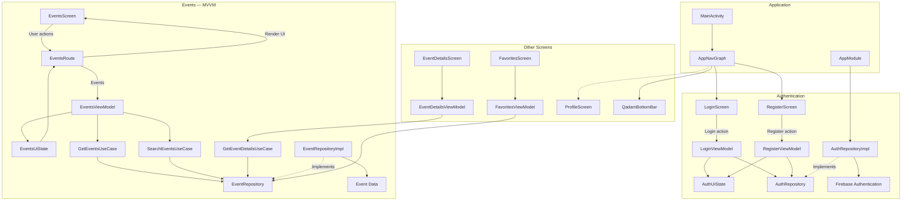

# Qadam Events — Architecture

```mermaid
flowchart TB

    subgraph APP["Application"]
        MA["MainActivity"]
        NAV["AppNavGraph"]
        DI["AppModule"]
    end

    subgraph AUTH["Authentication"]
        LOGIN["LoginScreen"]
        REGISTER["RegisterScreen"]
        LOGINVM["LoginViewModel"]
        REGVM["RegisterViewModel"]
        AUTHSTATE["AuthUiState"]
        AUTHREPO["AuthRepository"]
        AUTHIMPL["AuthRepositoryImpl"]
        FIREBASE["Firebase Authentication"]
    end

    subgraph EVENTS["Events — MVVM"]
        SCREEN["EventsScreen"]
        ROUTE["EventsRoute"]
        VM["EventsViewModel"]
        STATE["EventsUiState"]
        GET["GetEventsUseCase"]
        SEARCH["SearchEventsUseCase"]
        DETAILS["GetEventDetailsUseCase"]
        REPO["EventRepository"]
        REPOIMPL["EventRepositoryImpl"]
        DATA["Event Data"]
    end

    subgraph OTHER["Other Screens"]
        DETAILSCREEN["EventDetailsScreen"]
        DETAILVM["EventDetailsViewModel"]
        FAVSCREEN["FavoritesScreen"]
        FAVVM["FavoritesViewModel"]
        PROFILE["ProfileScreen"]
        BOTTOM["QadamBottomBar"]
    end

    MA --> NAV
    DI --> AUTHIMPL

    NAV --> LOGIN
    NAV --> REGISTER
    NAV --> BOTTOM

    LOGIN -->|"Login action"| LOGINVM
    REGISTER -->|"Register action"| REGVM

    LOGINVM --> AUTHSTATE
    REGVM --> AUTHSTATE

    LOGINVM --> AUTHREPO
    REGVM --> AUTHREPO
    AUTHIMPL -.->|"Implements"| AUTHREPO
    AUTHIMPL --> FIREBASE

    SCREEN -->|"User actions"| ROUTE
    ROUTE -->|"Events"| VM

    VM --> GET
    VM --> SEARCH

    GET --> REPO
    SEARCH --> REPO
    DETAILS --> REPO

    REPOIMPL -.->|"Implements"| REPO
    REPOIMPL --> DATA

    VM --> STATE
    STATE --> ROUTE
    ROUTE -->|"Render UI"| SCREEN

    DETAILSCREEN --> DETAILVM
    DETAILVM --> DETAILS

    FAVSCREEN --> FAVVM
    FAVVM --> REPO

    NAV -.-> PROFILE
```